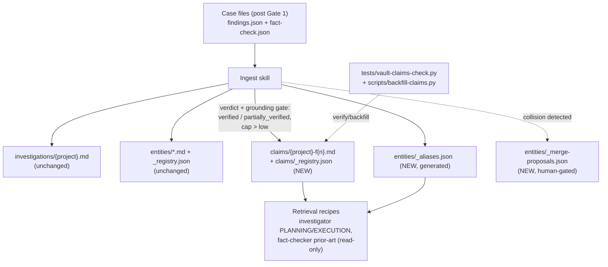

# feat: Claim-level intelligence base with alias index and temporal layering

## Summary

Add a claim-record layer to the Spotlight knowledge vault — standalone, cross-case-queryable claim notes with verdicts, source refs, and temporal metadata — plus a reverse alias index for entities, ingest-time quality gates, and standardized retrieval recipes for the investigator and fact-checker. Everything is additive: new note type, new registries, new ingest steps, no changes to existing notes, gates, sensitive mode, or the RLM boundary.

---

## Problem Frame

The vault compounds knowledge per entity, methodology, and tool, but claims — the atomic unit of investigative knowledge — exist only embedded in investigation notes and case-local JSON. A new investigation cannot ask "what do we already know about X, with what verdict, verified when, from which case?" without re-reading whole investigation notes. Entity aliases are recorded but only forward (entity → aliases), so an agent meeting an alternate spelling or former name cannot cheaply resolve it to the canonical entity. Nothing distinguishes a durable verified fact from a lead that was never re-checked, and ingest quality rules (tip curation, verdict flagging) are conventions without a validator.

The 2026-06 vault audit found the foundation is strong — 80 notes, 100% frontmatter compliance, 98.7% wikilink connectivity, zero stubs or duplicates — so this is structural extension, not cleanup.

---

## Requirements

**Claim records**

- R1. Every ingested finding produces a standalone claim note under `{vault}/claims/` carrying claim text, fact-check verdict (existing 6-value enum, unchanged), confidence, grounding confidence cap, source refs, originating project and finding ID, and linked entity IDs.
- R2. A `claims/_registry.json` indexes all claim records and is updated atomically with claim note creation, following the existing registry-coupling rule.
- R3. The claims layer admits verified intelligence only: a finding becomes a claim record only when its fact-check verdict is `verified` or `partially_verified` AND its grounding does not cap confidence at `low`. Findings with `unverified`, `disputed`, `false`, or `mischaracterized` verdicts, low-capped grounding, or RLM-derived origin stay case-local (they remain visible, flagged, in investigation notes as today).

**Entity aliases**

- R4. A generated reverse index `entities/_aliases.json` maps every alias (and canonical name) to its entity ID, rebuilt from entity frontmatter at each ingest.
- R5. When ingest detects a probable entity overlap (new entity whose name/alias collides with an existing entity's alias set), it records a merge proposal for human review; it never auto-merges.

**Temporal layering**

- R6. Claim records carry `recorded` (ingest date), `verified` (fact-check date and verifying project), and `layer: durable | lead` derived from verdict (`verified` → durable; `partially_verified` → lead with `needs_verification: true`).
- R7. Nothing is deleted or silently rewritten: when a later investigation re-verifies or supersedes a claim, the claim note gains a dated supersession entry; history is append-only.

**Quality gates and retrieval**

- R8. Ingest refuses claim records lacking source refs, and a validation script can verify the whole claims layer (registry/note parity, required frontmatter, source refs present, verdict enum valid, alias index consistent with entity frontmatter).
- R9. Investigator (PLANNING and EXECUTION) and fact-checker load the claims registry and alias index through documented retrieval recipes — claim dedup before research, prior-verdict citation, alias resolution — within the existing query caps; the vault stays read-only during investigation.
- R10. Existing `confirmed` investigations are backfilled into claim records and the alias index idempotently, applying the same eligibility gate as live ingest, with no edits to existing notes.

---

## Key Technical Decisions

- **Claims live in the knowledge vault (`vault_path`), as a fifth note type.** The vault already holds the four-type model with registries; claims extend it (`claims/` + `claims/_registry.json` + master `_registry.json` stats entry). `vault_path` is the only vault Spotlight knows; external consumers (e.g., a personal assistant agent) invoke the skill or read the vault — Spotlight carries no scaffolding for them.
- **The claims layer is stricter than investigation notes.** Investigation notes keep recording all Gate-1 findings with disputed/false flagged (unchanged, additive constraint). The claims layer — the cross-case queryable surface — admits only `verified`/`partially_verified` findings whose grounding does not cap confidence at `low`. This is the cleaner separation epistemic grounding was introduced for: contradictions and weak intel stay visible in their case context but never circulate as cross-case knowledge.
- **Temporal layering instead of forgetting.** Memory products (mem0, Supermemory) auto-resolve contradictions and expire facts; for investigations, contradictions are findings and history is evidence. Hence `layer: durable | lead`, append-only supersession entries, and no garbage collection.
- **Claim IDs are `{project-id}-f{n}`** (kebab-case rule preserved, traceable to the originating finding, collision-free because project IDs are unique).
- **`_aliases.json` is generated, never hand-edited.** Entity frontmatter `aliases` stays the source of truth; the reverse index is a derived artifact rebuilt at ingest and by the validation script, so it can never drift authoritatively.
- **Entity merges are human-gated.** Ingest writes proposals to `entities/_merge-proposals.json`; a human (or explicitly invoked review) resolves them. False identity joins are the worst failure mode for an investigation memory.
- **No new runtime dependencies.** Markdown + JSON + existing qmd/obsidian tooling; Python stdlib only for scripts, consistent with the plugin-distribution decision that plugin install ships instructions, not packages.
- **Sensitive vault parity by convention.** When a sensitive vault is enabled, it gets the same `claims/` structure; the existing no-cross-link rule applies unchanged.

---

## High-Level Technical Design



Claim note frontmatter (directional, exact fields pinned in U1):

```yaml
id: acme-files-f1
project: acme-files
finding_id: F1
entities: [acme-corp, john-doe]
verdict: verified          # existing 6-value enum
confidence: high
confidence_cap: high       # from grounding
layer: durable             # durable | lead
recorded: 2026-04-02
verified: 2026-04-02
verified_by: acme-files
needs_verification: false
```

---

## Implementation Units

### U1. Claim record and claims registry contract

- **Goal:** Define the claim note type and claims registry so every other unit has a stable contract.
- **Requirements:** R1, R2, R3, R6, R7
- **Dependencies:** none
- **Files:** `skills/ingest/references/entity-model.md`, `skills/ingest/references/registry-spec.md`
- **Approach:** Add the claim note type (frontmatter contract above, body sections: Claim, Evidence summary, Sources, Supersession history, wikilinks to `[[entity-id]]` and `[[project-id]]`) and the `claims/_registry.json` entry shape (id, project, entities, verdict, layer, recorded, verified, needs_verification, file). Document directory-vault fallback links and sensitive-vault parity. Extend the master `_registry.json` stats and `_INDEX.md` conventions to include claims.
- **Test scenarios:** Test expectation: none — documentation contract; enforced by U5's validator.
- **Verification:** Contract covers every field the backfill (U6) needs to populate from the five existing investigations without inventing data.

### U2. Alias reverse index and merge proposals

- **Goal:** Cheap alias → entity resolution and safe overlap handling.
- **Requirements:** R4, R5
- **Dependencies:** U1 (registry-spec conventions)
- **Files:** `skills/ingest/references/registry-spec.md`, `skills/ingest/SKILL.md`
- **Approach:** Specify `entities/_aliases.json` (normalized alias string → entity id; includes canonical names; case-insensitive match guidance) as a generated artifact rebuilt during ingest step 3. Specify `entities/_merge-proposals.json` (candidate pair, colliding alias, source project, date, status: open/accepted/rejected) written when a new entity's name or aliases collide with an existing entity's alias set; ingest proceeds with both entities separate until a human resolves.
- **Test scenarios** (enforced via U5 validator): alias index contains every alias from every entity note; collision between new entity name and existing alias produces a proposal, not a merge; rejected proposal is preserved (not re-proposed blindly each ingest).
- **Verification:** Resolving a known alias via the index returns its canonical entity ID against the live vault.

### U3. Ingest skill extension with claim quality gates

- **Goal:** Ingest writes claim records, the alias index, and merge proposals atomically, with explicit refusal rules.
- **Requirements:** R1, R2, R3, R4, R5, R8 (gate side)
- **Dependencies:** U1, U2
- **Files:** `skills/ingest/SKILL.md`
- **Approach:** Insert a claim-extraction step into the existing 7-step process (after entity notes, before final registry sync): for each finding in `findings.json`, join its fact-check verdict and apply the eligibility gate — verdict `verified` or `partially_verified`, grounding `confidence_cap` above `low`, at least one source ref, not RLM-derived. Eligible findings produce a claim note and registry entry with `layer` derived per R6; ineligible findings are logged with their exclusion reason (so the ingest summary shows what was filtered and why), never written. Re-ingest of the same project updates claims idempotently (registry-level idempotence rule extended); a re-verified claim appends a supersession entry instead of overwriting. Honor `.ingest-lock` and `--target sensitive` unchanged.
- **Test scenarios** (enforced via U5 validator + a fixture ingest): verdict `verified` → claim with `layer: durable`; verdict `partially_verified` → `layer: lead` with `needs_verification: true`; verdicts `unverified`/`disputed`/`false`/`mischaracterized` → no claim note, exclusion logged; grounding `confidence_cap: low` → no claim, exclusion logged; finding without sources → no claim note and no registry entry; running ingest twice → no duplicate claims; claim count in master registry stats matches `claims/` file count.
- **Verification:** Dry-run instructions against an existing case fixture produce claims for every gated finding and zero orphan registry entries.

### U4. Retrieval recipes for investigator and fact-checker

- **Goal:** Agents consult the claims layer and alias index without raising query budgets or touching the read-only rule.
- **Requirements:** R9
- **Dependencies:** U1, U2
- **Files:** `agents/investigator.md`, `agents/fact-checker.md`, `docs/investigating.md`
- **Approach:** Extend the existing "load registries once" pattern: PLANNING additionally loads `claims/_registry.json` and `entities/_aliases.json`; before researching a brief topic, run the claim-dedup recipe (filter claims by entity/alias hit; cite as `Prior verdict: [[claim-id]] — {verdict}, verified {date} by [[project-id]]`); a durable prior verdict downgrades re-research to spot-confirmation, a lead-layer claim becomes an explicit lead. EXECUTION alias lookups go through the alias index before semantic fallback. Fact-checker prior-art check adds claim lookups for top-priority claims, still capped (~5/cycle), and never suppresses a verdict because of prior context.
- **Test scenarios:** Test expectation: none — agent prompt contract; behavior exercised by pipeline evals, structure checked by U5 (recipes reference only files U1/U2 define).
- **Verification:** Both agent files reference the new registries with the same load-once discipline and unchanged query caps.

### U5. Claims layer validator

- **Goal:** Turn the conventions into checkable invariants.
- **Requirements:** R8
- **Dependencies:** U1, U2, U3
- **Files:** `tests/vault-claims-check.py` (new), `tests/smoke.sh`
- **Approach:** Stdlib-only checker in the style of existing `tests/*-check.py`: validates claim frontmatter required fields and verdict enum, registry/note parity both directions, source refs present, `layer` consistent with verdict, alias index exactly derivable from entity frontmatter, merge-proposal schema, and master registry stats. Runs against a fixture vault in `tests/fixtures/` and (optionally, via flag) a real vault path. Wire into `smoke.sh`.
- **Test scenarios:** valid fixture vault passes; claim note missing from registry fails; registry entry without note fails; claim without sources fails; alias present in entity note but absent from index fails; invalid verdict value fails; stats mismatch fails.
- **Verification:** Checker passes on fixture and on the live vault after U6 backfill.

### U6. Idempotent backfill of existing investigations

- **Goal:** Populate the claims layer and alias index from the five existing investigations so retrieval works day one.
- **Requirements:** R10, R6
- **Dependencies:** U1, U2, U3, U5
- **Files:** `scripts/backfill-claims.py` (new)
- **Approach:** Parse existing `investigations/*.md` finding sections (Claim/Confidence/Verdict/Sources are uniformly structured) plus registries; apply the same eligibility gate as U3 — only investigations with `status: confirmed`, only findings whose verdict maps to `verified`/`partially_verified` (legacy labels `confirmed` → verified), with sources present; everything else is reported as excluded, not written. Emit claim notes, claims registry, alias index, and updated master stats. `recorded`/`verified` come from the investigation `date`. Idempotent (re-run produces no diff), refuses to modify existing notes, honors `.ingest-lock`, path-contained via the `spotlight_safe.py` probe pattern. Existing investigation notes are read-only inputs.
- **Test scenarios:** backfill on a fixture copy of the live vault yields claims for every verified finding in the four `confirmed` investigations; any `pending_review` investigation is skipped and reported, not ingested; unverified findings are excluded and listed in the report; second run is a no-op; a malformed finding section is reported and skipped, not half-written; entity files untouched (hash-equal before/after).
- **Verification:** `tests/vault-claims-check.py` passes against the backfilled vault; spot-check that a backfilled claim cites its original sources.

### U7. Plugin payload and distribution parity

- **Goal:** Ship the updated skill/agent instructions through the existing plugin pipeline without drift.
- **Requirements:** supports all (distribution of R1–R9 contracts)
- **Dependencies:** U1–U5
- **Files:** `scripts/build-plugin-payload.py` (allowlist check only), `plugins/spotlight/` (generated), `tests/plugin-distribution-check.py` (existing, must pass)
- **Approach:** Regenerate the plugin payload after skill/agent edits; confirm the allowlist already covers `skills/ingest/`, `agents/`, and the new test isn't shipped in the payload. No version/metadata semantics change beyond the standard bump.
- **Test scenarios:** Test expectation: none — covered by the existing `plugin-distribution-check.py` parity suite.
- **Verification:** Parity check passes; payload diff contains only the intended skill/agent/doc changes.

### U8. Remove dormant Mycroft handoff scaffolding

- **Goal:** Spotlight carries no consumer-specific scaffolding; external agents invoke the skill or read the vault.
- **Requirements:** hygiene supporting the KTD that `vault_path` is the only vault Spotlight knows
- **Dependencies:** none (independent of U1–U7)
- **Files:** `install-spotlight.sh`
- **Approach:** Drop the `handoff-to-mycroft/` directory creation and its README line from the installer. Nothing in the repo reads or writes that directory; the `ingest_target`/`mycroft_vault_path`/`handoff_path` config fields were never Spotlight contract (they are written by an external installer into local config and consumed by nothing here).
- **Test scenarios:** Test expectation: none — installer scaffolding removal; covered by `tests/install-spotlight-smoke.sh`.
- **Verification:** Install smoke test passes; fresh install creates no Mycroft-named paths.

---

## Scope Boundaries

**Deferred to follow-up work**

- RLM read-only vault-corpus mode (touches path containment, the highest-conflict surface with sensitive mode).
- Retroactive vault cleanup passes (the audit found nothing needing one).

**Outside this product's identity**

- Automatic entity merging, automatic contradiction resolution, automatic forgetting/expiry of claims.
- External or hosted memory services (mem0, Supermemory, Unabyss) and any new local daemon, database, or vector store.

---

## Risks

- **Claims registry growth.** Claims will outnumber most other registry entries over time (backfill yields the verified findings of the four confirmed investigations; each future case adds its verified findings). Mitigation: registry entries stay minimal (note bodies carry the detail), and the load-once pattern already tolerates this scale; revisit sharding by project only if a real vault shows load pain.
- **Instruction-driven ingest.** The ingest skill is executed by an agent following markdown, so gates are prompt contracts, not code. Mitigation: U5's validator is the enforcement backstop and runs in `smoke.sh`; the backfill script is deterministic code.
- **Finding-section parsing for backfill.** The five investigation notes are uniformly structured today, but parsing markdown is brittle. Mitigation: skip-and-report on malformed sections; validator confirms completeness against `verified_count`/`total_findings` frontmatter.

---

## Sources

- Vault audit and architecture research, 2026-06-11 session: `skills/ingest/SKILL.md`, `skills/ingest/references/entity-model.md`, `skills/ingest/references/registry-spec.md`, `agents/investigator.md`, `agents/fact-checker.md`, `docs/investigating.md` (readiness criteria, read-only rule), `docs/sensitivity.md` (sensitive vault rules), the RLM boundary skill (`kit/rlm/SKILL.md` in the parent shared-skills repo), `docs/plans/spotlight-plugin-distribution-plan.md` (plugin payload decisions).
- Prior-art scan (same session): mem0.ai, supermemory (GitHub), unabyss.com — shaped the temporal-layering-not-forgetting and human-gated-merge decisions.
