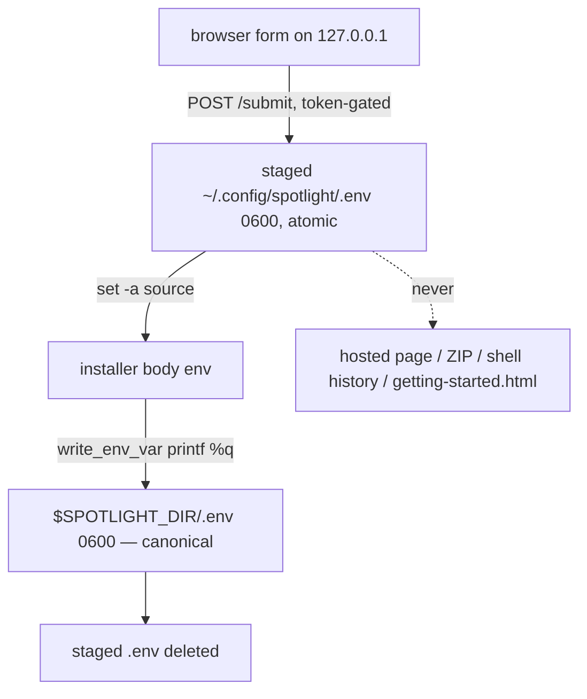

# refactor: Replace hosted key collection with static installer + local configurator

## Summary

Port the install architecture Mycroft shipped on 2026-06-11 to Spotlight: one static, key-free `curl | bash` command; a local configurator served from `127.0.0.1` that collects every choice and API key with live validation and a native folder picker; `setup.html` converted to a landing page. The `SPOTLIGHT_CONFIG` base64 blob — which today carries four API keys through the clipboard, shell history, and downloadable ZIPs — is retired outright.

Cross-repo references to the pattern source use the form `mycroft:<path>` (sibling repo `buriedsignals/mycroft`). Code is **copied and adapted**, not shared as a module — both public repos stay self-contained.

---

## Problem Frame

Spotlight's hosted `setup.html` collects `FIRECRAWL_API_KEY`, `OSINT_NAV_API_KEY`, `JUNKIPEDIA_API_KEY`, and the opencode cloud key in a browser form, single-quote-escapes them into an `export` block, base64-encodes it, and emits `curl … | SPOTLIGHT_CONFIG='<b64>' bash`. Base64 is encoding, not encryption: the keys land in `.zsh_history` and the clipboard, and the ZIP fallback embeds them in `spotlight-setup.command` permanently. `DISCLAIMER.md`'s claim that keys "never leave your machine" is only true in the narrow server sense — the delivery channel itself leaks them locally.

The fix is the input channel, not the installer: `install-spotlight.sh` is already a static, reviewable, pinned script. Its head (`base64 -d | eval`, lines 1–22) is replaced; its 1,000+ line body keeps consuming the same env vars.

---

## Requirements

**Key handling**

- R1. In the guided install, no API key ever appears on a hosted page, in a downloadable artifact, in the shell command line, or in shell history. The hosted pages contain no form fields.
- R2. Keys are entered only on a configurator page served from `127.0.0.1` by the installer itself, guarded by a per-run CSRF token on every endpoint (GET and POST), and written with owner-only permissions.
- R3. Keys are live-validated per provider before the install proceeds: HTTP 401/403 rejects; network failures and non-auth errors never block.

**Install UX**

- R4. One canonical command installs Spotlight: `curl -fsSL https://spotlight.buriedsignals.com/install-spotlight.sh | bash`. The ZIP fallback contains only a key-free bootstrap that fetches and runs the same script.
- R5. The configurator offers a native folder picker (osascript/zenity/kdialog) and per-OS default-path chips for install and vault paths.
- R6. Submission is blocked until required fields are present (Firecrawl key, OSINT Navigator key, install path, vault path; cloud key when runtime is opencode), with field-level errors. Choices that will fail later in the body (Tolaria not installed, vault nested in install dir) fail at submit time instead.
- R7. The install ends by opening a personalized `getting-started.html` reflecting the user's mode, runtime, and integrations — only after preflight has run.

**Compatibility**

- R8. The installer body contract is preserved: env var names, dependency pins, doctor/updater generation (including the unexpanded `SPOTLIGHT_DIR_INPUT`/`SPOTLIGHT_VAULT_INPUT` literals their heredocs bake in), `.spotlight-config.json` schema, shell-rc block, preflight, `--dry-run`.
- R9. A headless path (`--headless` + pre-exported env vars) replaces `SPOTLIGHT_CONFIG` for CI and power users; the existing `:?` guards enforce required vars. Headless documentation instructs loading keys from a 0600 env file (`set -a; . keys.env; set +a`) rather than inline `export`s, so the no-keys-in-history claim holds on this path too.
- R10. A run with `SPOTLIGHT_CONFIG` set fails immediately with an explicit message pointing to the new install method — never silently ignored.
- R11. Mycroft's plugin install path (writes `.spotlight-config.json` directly, never runs `install-spotlight.sh`) is unaffected.

**Quality**

- R12. CI validates the installer (parse + fragment assertions + dry-run smoke) and the configurator (unit + live-server contract) before anything deploys; `setup-generator-check.js` is replaced, and the currently stale, unwired `install-spotlight-smoke.sh` is rewritten and wired in.
- R13. All docs, the `plugins/spotlight/` mirror (regenerated, not hand-edited), `llms.txt`/`llms_full.txt`, and `sitemap.xml` describe the new flow; `DISCLAIMER.md`'s key-handling claim becomes true.

---

## Key Technical Decisions

- **Configurator runs before clone; assets resolve worktree-first, then curl.** Unlike Mycroft (fixed clone location before the configurator), Spotlight's install path is itself a form field — the configurator must run before the repo exists. The head uses repo-local `install/setup_server.py` + `install/configure.html` when `[ -f "${BASH_SOURCE[0]-}" ]` and they sit next to the script; otherwise it curls both from `https://spotlight.buriedsignals.com/install/…` into a `mktemp -d` dir. A shared `CONFIGURATOR_VERSION` constant in all three files is asserted after fetch; mismatch fails loud with a "Pages CDN still propagating — retry in ~10 minutes" message (kills the silent 403-on-every-POST skew mode).
- **`SPOTLIGHT_CONFIG` is retired with a hard error, not decoded.** Old one-liners and `.command` files in the wild get `"This install method was retired — run: curl -fsSL https://spotlight.buriedsignals.com/install-spotlight.sh | bash"` and exit 1. Keeping the `base64 -d | eval` path alive for back-compat would preserve exactly the code path being removed.
- **Artifact contract: `~/.config/spotlight/` staging, then handoff to `$SPOTLIGHT_DIR`.** The server writes `setup-config.env` (choice flags, 0600), `.env` (secrets, 0600, atomic temp-name + rename), and `getting-started.html` (0644) into `~/.config/spotlight/` (mode 0700). The head sources both env files (`set -a`); the body then writes the final `$SPOTLIGHT_DIR/.env` exactly as today. The staged `.env` is deleted after the final one is written, so secrets never diverge across two copies. On re-run with a completed install present (`$SPOTLIGHT_DIR/.spotlight-config.json` + `.env`), a `/dev/tty` prompt offers "Reuse previous configuration?" and sources the final `.env` + retained `setup-config.env` instead of reopening the configurator. The gate resolves the install dir as `${SPOTLIGHT_DIR:-}` from the environment (rc-block export) first, falling back to expanding `SPOTLIGHT_DIR_INPUT` from the retained `setup-config.env`; if neither resolves to a completed install, skip the gate and open the configurator.
- **Key validation classes**: Firecrawl strict (`api.firecrawl.dev/v1/team/credit-usage`); OSINT Navigator strict **pending endpoint verification** — confirm during implementation that a Navigator GET endpoint genuinely returns 401 on a bad key (the probe maps 404/405/500 to "ok", so a wrong endpoint would validate every bad key); fall back to lenient if no such endpoint exists. Opencode cloud key strict per provider — OpenRouter via `openrouter.ai/api/v1/key` (its `/models` endpoint is public and returns 200 unauthenticated, so it cannot reject a bad key; `/api/v1/key` verified to 401), Fireworks/Together via their auth-gated `…/models` endpoints; junkipedia lenient; unpaywall email format-check only. The `probe()` semantics copy verbatim from `mycroft:install/setup_server.py` — reject only on 401/403, "unreachable" always warns.
- **Pins stay single-sourced in the installer.** `configure.html` collects the runtime *choice* only and carries no version strings, eliminating `setup.html`'s `RUNTIMES` pin duplicate (the fourth copy). `tests/dependency-pins-check.py` and `tests/eval.sh` retarget accordingly.
- **Hardening deltas beyond the Mycroft copy** (Spotlight's threat posture is higher): GET requires `?t=<token>` (Mycroft serves the token-baked page to any local process); artifact writes are atomic all-or-nothing; the configurator validates Tolaria presence server-side on macOS at submit; vault path must not equal or nest inside the install path; the head verifies `python3 -c pass` actually executes (not just `command -v`) and runs the CLT consent **before** the configurator on macOS; `SSH_TTY`/missing-`DISPLAY` detection prints port-forward and `--headless` instructions instead of silently failing `webbrowser.open`.
- **`setup.html` keeps its filename.** `index.html` CSS selectors key on `href$="setup.html"`, the sitemap and external links point at it; the conversion changes content, not URL.

---

## High-Level Technical Design

Install sequencing and branch gates (new head in bold-equivalent positions; body unchanged):

```mermaid
flowchart TB
  A[curl -fsSL .../install-spotlight.sh | bash] --> B{SPOTLIGHT_CONFIG set?}
  B -->|yes| Bx[exit 1: method retired, print new command]
  B -->|no| C{--headless?}
  C -->|yes| H[require env vars via :? guards] --> N[existing body]
  C -->|no| D[python3 executes? CLT consent on mac]
  D --> E{completed install at SPOTLIGHT_DIR?}
  E -->|yes, user reuses| R[source final .env + setup-config.env] --> N
  E -->|no| F{worktree assets present?}
  F -->|yes| G[use repo-local server+page]
  F -->|no| G2[curl both from Pages domain, assert CONFIGURATOR_VERSION]
  G --> S[setup_server.py on 127.0.0.1, CSRF token, 30-min timeout]
  G2 --> S
  S --> W[write artifacts to ~/.config/spotlight]
  W --> V{artifacts exist? double gate}
  V -->|no| Vx[exit 1: configuration not completed]
  V -->|yes| K[set -a source setup-config.env + staged .env] --> N
  N --> Z[clone to SPOTLIGHT_DIR, pinned deps, final .env, config json, doctor/updater, rc block, preflight]
  Z --> Y[delete staged .env, open getting-started.html]
```

Secret lifecycle (one copy at rest after completion):



---

## Implementation Units

### U1. Configurator server: `install/setup_server.py`

- **Goal:** Local stdlib-only HTTP server that serves the form, validates choices and keys, and writes the three artifacts.
- **Requirements:** R2, R3, R6, R7
- **Dependencies:** none
- **Files:** `install/setup_server.py` (new)
- **Approach:** Copy from `mycroft:install/setup_server.py`, keeping verbatim: `detect_platform`, `pick_folder_natively`, `probe`, `expand_home_for_shell`, the `main()`/`Handler` skeleton (token via `secrets.token_urlsafe`, `__SETUP_TOKEN__`/`__PLATFORM__` injection, loopback bind, `--port 0` default, 30-min `done.wait`, flush-before-shutdown timer, `--profile-dir/--repo-dir/--port/--no-browser/--skip-key-validation` flags). Replace: `validate_choices` rules (required keys/paths; cloud key iff opencode; Tolaria present on mac when selected; vault not equal to or nested in install path), `validate_keys` table (classes per KTD), `build_env_lines` (Spotlight's secret set), `build_setup_config` (the full choice-flag contract: `SPOTLIGHT_MODE/RUNTIME/AGENT/LOCAL_*/OPENCODE_*/VAULT_APP/INT_*/RLM_*` + `SPOTLIGHT_DIR_INPUT`/`SPOTLIGHT_VAULT_INPUT` carried as entered, plus `SPOTLIGHT_CLOUD_KEY_VAR` derived from the provider selection and `SPOTLIGHT_MODEL_REPO` derived from the local-model selection — the body gates the cloud-key write on the former and the GGUF download on the latter, and the staged `.env` carries the key itself as `SPOTLIGHT_CLOUD_KEY`, matching the `buildExportBlock` inventory cited in Sources), `build_getting_started` (Spotlight content). Drop `build_skill_registry`. Add the hardening deltas: GET token gate; atomic writes with secure-at-creation modes (secret temp files opened `O_WRONLY|O_CREAT|O_EXCL, 0o600` before any content is written; profile dir chmod'd 0700 even when it pre-exists); `CONFIGURATOR_VERSION` constant. `normalize()` must not default emptied paths (enum choices may default).
- **Patterns to follow:** `mycroft:install/setup_server.py` throughout; `scripts/spotlight_safe.py` for input-validation idiom.
- **Test scenarios:** (executed by U5's test file; enumerated here as the contract)
  - Validation matrix: missing firecrawl key → `firecrawl_key` field error; missing nav key; empty/whitespace vault path; vault == install path; vault nested under install path; opencode without cloud key errors, claude without cloud key passes; tolaria selected + app absent (mac) errors, obsidian never checks; junkipedia enabled without key warns not errors.
  - Key routing with stubbed `probe`: `rejected` → errors exactly on strict fields, warnings for lenient; `unreachable` → zero errors; `--skip-key-validation` bypasses all probes.
  - Artifacts: modes 0600/0600/0644, profile dir 0700; staged `.env` quotes secrets via `shlex.quote`; `setup-config.env` and `getting-started.html` contain no secret from the test secret list; atomic write leaves nothing on injected failure.
  - Live server: placeholders replaced; GET without `?t=` → 403; POST bad token → 403 on both `/submit` and `/pick-folder`; 400 carries field errors; good submit → 200, server exits 0, artifacts present.
- **Verification:** `python3 tests/configurator-server-check.py` green; a manual `--no-browser --skip-key-validation` run against a temp profile dir produces sourceable artifacts.

### U2. Configurator page: `install/configure.html`

- **Goal:** Self-contained local form carrying every choice the current `setup.html` form collects.
- **Requirements:** R2, R5, R6
- **Dependencies:** U1 (field ids are the server's error contract)
- **Files:** `install/configure.html` (new)
- **Approach:** Mycroft's design-language shell (vellum/ink/oxide CSS vars, numbered sections, radio cards, body-class mode toggling, `.path-row` + Browse, `.os-chips` with `dataset.touched`, `showErrors` + `.fld--missing` + scrollIntoView, submit "Verifying keys…" state, done-shell). Sections: 01 Mode (cloud/local) → 02 Agent (cloud: claude/gemini/codex/opencode + provider picker and cloud key for opencode; local: opencode→ollama / pi→llamacpp derivation, qwen9b/qwen27b cards with GGUF download sizes stated, hardware fit-check ported from `setup.html`) → 03 Required (Firecrawl key, OSINT Navigator key, vault app obsidian/tolaria, install path + vault path with Browse and OS chips) → 04 Plug-ins (dev-browser default-on no-key, junkipedia + key, unpaywall + email, RLM off/lite/local_gemma4_e4b). No version pins anywhere. Done-shell copy: "return to the terminal — the install continues there." Field ids match U1's `normalize()`/error fields.
- **Patterns to follow:** `mycroft:install/configure.html` (mechanics), current `setup.html` form sections (content, option values, fit-check JS, `RUNTIMES` reduced to choices).
- **Test scenarios:** Covered structurally by U5 (HTML parses; `CONFIGURATOR_VERSION` present; no `_KEY` value literals; eval.sh runtime-option consistency greps retargeted here). Interactive behavior (chips, browse, mode toggle) verified manually in the U5 verification run.
- **Verification:** Page renders from a live `setup_server.py`; submitting with empty required fields paints field errors; OS chips and Browse fill paths.

### U3. Installer head swap: `install-spotlight.sh`

- **Goal:** Replace the blob/eval head with bootstrap → configurator → source-artifacts; leave the body intact except four touch-points.
- **Requirements:** R4, R7, R8, R9, R10
- **Dependencies:** U1, U2
- **Files:** `install-spotlight.sh`
- **Approach:** New head implements the HTD flowchart: `SPOTLIGHT_CONFIG` retirement error; `--headless` parse (alongside `--dry-run`); python3-executes check with macOS CLT consent moved ahead of the configurator; reuse prompt on completed installs; worktree-vs-curl asset resolution with `CONFIGURATOR_VERSION` assertion; SSH/no-DISPLAY guidance; double gate (server exit code + artifact existence) with "configuration was not completed; re-run" messages; `set -a` sourcing. Body touch-points only: (1) delete staged `~/.config/spotlight/.env` after the final `$SPOTLIGHT_DIR/.env` write succeeds, with an EXIT/ERR trap in the head deleting it on any earlier termination so aborted installs never orphan secrets; (2) when an existing `.spotlight-config.json` carries a different vault path, warn and re-add the qmd collection ("old vault data not migrated"); (3) open `getting-started.html` after preflight (mac `open` / `xdg-open` / WSL `wslview`, all `|| true`); (4) drop the now-dead "generate at setup.html" error copy. `SPOTLIGHT_DIR_INPUT`/`SPOTLIGHT_VAULT_INPUT` keep flowing unexpanded into the doctor/updater/launcher heredocs.
- **Execution note:** Characterize first — correct the smoke fixtures' stale values (`SPOTLIGHT_INT_BROWSERUSE` → `SPOTLIGHT_INT_DEVBROWSER`, `gemma` → `qwen9b`/`qwen27b`; the `gemma` fixture currently characterizes the empty fall-through branch), then capture the old head's `--dry-run` output for the four combos via the existing `mkb64` blob mechanism *before* touching the head, so the U5 re-baseline diffs only the head swap, never fixture corrections.
- **Test scenarios:** (run via U5)
  - `SPOTLIGHT_CONFIG=x bash install-spotlight.sh` → exit 1, message contains the new curl command.
  - `--headless --dry-run` with full env set → existing DRY-RUN contract lines appear; with `FIRECRAWL_API_KEY` unset → `:?` guard fails naming the var.
  - `bash -n` parses; fragment assertions: includes configurator invocation, artifact double-gate, `CONFIGURATOR_VERSION`, staged-env deletion + abort trap; excludes `base64 -d`, `SPOTLIGHT_CONFIG='`, `eval "$(printf`.
  - Worktree run uses local assets (no network fetch in dry-run logs).
- **Verification:** Smoke matrix green; a real end-to-end run from a clean working tree completes the configurator and reaches preflight.

### U4. Landing page: `setup.html`

- **Goal:** Convert the form page into a static landing page; hosted page carries zero form fields.
- **Requirements:** R1, R4
- **Dependencies:** U3 (the command it advertises must work)
- **Files:** `setup.html`
- **Approach:** Keep: head/meta, `#cubes-backdrop` iframe, topnav + theme switcher, hero, reveal scripts, footer. Replace sections 01–07 + `#install-output` with the Mycroft landing shape: 01 How it works (terminal → local browser config → investigate) / 02 Have these ready (Firecrawl + OSINT Navigator required; opencode provider key conditional; extras) / 03 dark install slab with `.cmd-block` (`curl -fsSL https://spotlight.buriedsignals.com/install-spotlight.sh | bash` + Copy), Read-the-script ghost link first, Download ZIP solid button second. ZIP reuses the existing `crc32`/`buildZipEntries` writer with a single key-free bootstrap entry (`mktemp` + curl + `exec bash`, exec bit `0o100755`). Delete: the form, `collectForm`/`buildExportBlock`/`shellEscape`/`utf8Base64`/`buildOneLiner`/`buildCommandScript`, fit-check (moved to U2), and the multi-step Gatekeeper "Open Anyway" walkthrough — but keep a one-line right-click → Open note beside the ZIP button: quarantine attaches by download provenance, so the double-clicked bootstrap still triggers Gatekeeper (mirror Mycroft's landing copy). Audit CSS scoped to removed wrappers (the Mycroft `e192173` regression class).
- **Test scenarios:** HTML parses; contains the curl one-liner and no `<input type="password">`; no `SPOTLIGHT_CONFIG` string; ZIP bootstrap fetches the Pages-domain URL. (Asserted in U5's landing-page section of `tests/install-spotlight-check.sh`.)
- **Verification:** Page renders correctly served locally; Copy and ZIP buttons work; section rhythm matches the rest of the site.

### U5. Tests + CI

- **Goal:** Replace the generator test, wire the smoke test in, and cover the new surfaces.
- **Requirements:** R12
- **Dependencies:** U1–U4
- **Files:** `tests/configurator-server-check.py` (new), `tests/install-spotlight-check.sh` (new, includes the landing-page assertion section), `tests/install-spotlight-smoke.sh` (rewrite), `tests/setup-generator-check.js` (delete), `tests/dependency-pins-check.py`, `tests/eval.sh`, `tests/smoke.sh`, `.github/workflows/ci.yml`
- **Approach:** `configurator-server-check.py` ports Mycroft's two-tier pattern (unit tier imports the module; live tier `Popen` on a fixed port with `--no-browser --skip-key-validation`, temp profile dir) carrying U1's scenario list. `install-spotlight-check.sh` ports the `bash -n` + `includes`/`excludes` fragment style with U3's lists + optional shellcheck. Rewrite `install-spotlight-smoke.sh`: drop `mkb64`, export vars directly + `--headless --dry-run`, fix the stale fixtures (`SPOTLIGHT_INT_BROWSERUSE`, `SPOTLIGHT_LOCAL_MODEL=gemma`), keep the per-combo DRY-RUN assertions against the U3 characterization baseline — and wire it into `smoke.sh` (which CI already runs; today the smoke test runs nowhere). Landing-page assertions (curl one-liner present, no password inputs, no `SPOTLIGHT_CONFIG` string, bootstrap fetches the Pages URL) live as a section of `tests/install-spotlight-check.sh`, not a separate file. Update `dependency-pins-check.py` (its `setup.html` string-asserts move to checking configure.html carries *no* pins) and `eval.sh` (runtime-consistency greps target `configure.html`). CI: replace the `setup-generator-check.js` step with the two new checks and add an HTML-parse check covering `setup.html` + `install/configure.html` (none exists today).
- **Test scenarios:** The suite *is* the scenarios (U1/U3/U4 lists). Meta-checks: `smoke.sh` still counts ✓/✗ without aborting; CI fails when any check fails (verify once by intentionally breaking a fragment locally).
- **Verification:** `bash tests/smoke.sh && bash tests/eval.sh` green locally; full CI green on push.

### U6. Docs, plugin payload, changelog

- **Goal:** Every description of the install flow matches reality; the security claim becomes true.
- **Requirements:** R13
- **Dependencies:** U1–U5
- **Files:** `README.md`, `CONTRIBUTING.md`, `DISCLAIMER.md`, `DESIGN.md`, `docs/index.html`, `docs/integrations.md`, `docs/runtimes.md`, `docs/structure.md`, `docs/sensitivity.md`, `llms.txt`, `llms_full.txt`, `sitemap.xml`, `CHANGELOG.md`, `plugins/spotlight/` (via `scripts/build-plugin-payload.py`), `skills/spotlight/SKILL.md` (wording check only)
- **Approach:** README install section mirrors Mycroft's (Guided = curl block; Local = clone + run from tree; the keys-never-transit wording from `mycroft:SECURITY.md`'s threat model lands in README + DISCLAIMER). CONTRIBUTING's "RUNTIMES const in setup.html is the source of truth" section rewrites to point at `configure.html` choices + installer pins. CHANGELOG gets the Mycroft-style "Changed — installation architecture" + "Removed" (hosted base64 env-blob generator, per-user ZIPs, Gatekeeper dance) entries. Regenerate the plugin payload — never hand-edit the mirror.
- **Test expectation:** none — docs/copy; `tests/plugin-distribution-check.py` and the U5 suite catch drift mechanically.
- **Verification:** `grep -ri SPOTLIGHT_CONFIG --include='*.md' --include='*.html' --include='*.txt'` returns only CHANGELOG history and this plan; plugin-distribution check green.

---

## Scope Boundaries

**Deferred to follow-up work**

- Backport the hardening deltas (GET token gate, atomic artifact writes) to `mycroft:install/setup_server.py`.
- Pre-filling the configurator from an existing old-era `$SPOTLIGHT_DIR/.env` so upgraders don't re-type keys (the reuse prompt covers the common case).
- qmd collection *migration* on vault-path change (this plan warns and re-points only).
- A standalone `SECURITY.md` for Spotlight (threat-model wording lands in README/DISCLAIMER for now).

**Out of scope**

- `.spotlight-config.json` schema, integration manifests, skills, agents, container/, evals.
- Plugin payload structure and mechanics. U6's `plugins/spotlight/` regeneration is a forced mechanical mirror sync — `tests/plugin-distribution-check.py` byte-compares mirrored docs against repo-root sources, so the U6 doc edits cannot land without re-running `scripts/build-plugin-payload.py`. No payload structure, manifest, or install-path changes.
- Anything in the Mycroft repo.
- Changing dependency pins or `VALIDATED_DEPENDENCIES.md` content.

---

## Risks & Dependencies

- **OSINT Navigator probe endpoint** — strict validation is only honest if a GET genuinely 401s on a bad key; the probe treats 404/405/500 as "ok". Must be verified against the live Navigator API during U1; fall back to lenient and note it in the configurator copy if no such endpoint exists.
- **Pages CDN propagation skew** — old script + new assets (or vice versa) within ~10 minutes of a deploy. Mitigated by the `CONFIGURATOR_VERSION` assertion; residual risk is a loud retry message, which is acceptable.
- **Dry-run baseline re-cut** — the smoke test's DRY-RUN strings are frozen contract today but the fixtures are already stale and the test runs nowhere; U3's characterization step makes the re-baseline an explicit reviewed diff.
- **`/dev/tty` interactions under `curl | bash`** — the new reuse prompt and CLT consent read `/dev/tty` with safe defaults (`|| ans="Y"`-style), matching the body's existing prompts; the configurator itself consumes no stdin.
- **Doctor/updater heredoc literals** — they bake `SPOTLIGHT_DIR_INPUT`/`SPOTLIGHT_VAULT_INPUT` verbatim; the configurator must emit these vars (absolute paths from the picker are fine, `~/` from typed input is fine) or generated CLIs break. Pinned by a U5 fragment assertion.

---

## Sources & Research

- Pattern source (verified working, shipped 2026-06-11): `mycroft:install.sh`, `mycroft:install/setup_server.py`, `mycroft:install/configure.html`, `mycroft:tests/setup-server-check.py`, `mycroft:tests/install-sh-check.sh`.
- Current contract: `install-spotlight.sh` lines 1–22 (blob/eval head — the swap zone) and 23–110 (arg parse, path derivation, pins, `:?` guards — retained), 829–878 (`.env` write), 982–1089 (doctor/updater heredocs); `setup.html` lines 1686–1742 (`buildExportBlock` env-var list — the canonical field inventory the configurator must reproduce); `tests/install-spotlight-smoke.sh` (stale, unwired); `VALIDATED_DEPENDENCIES.md`.
- Deployment: GitHub Pages legacy branch build, repo root, `CNAME` = spotlight.buriedsignals.com, `.nojekyll` present — `https://spotlight.buriedsignals.com/install-spotlight.sh` already resolves.
